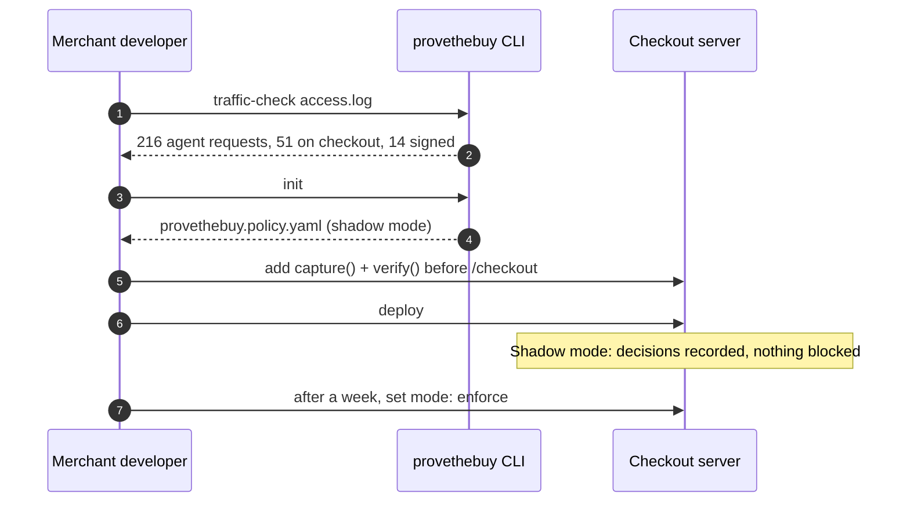
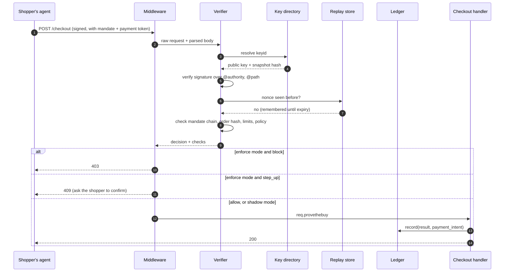
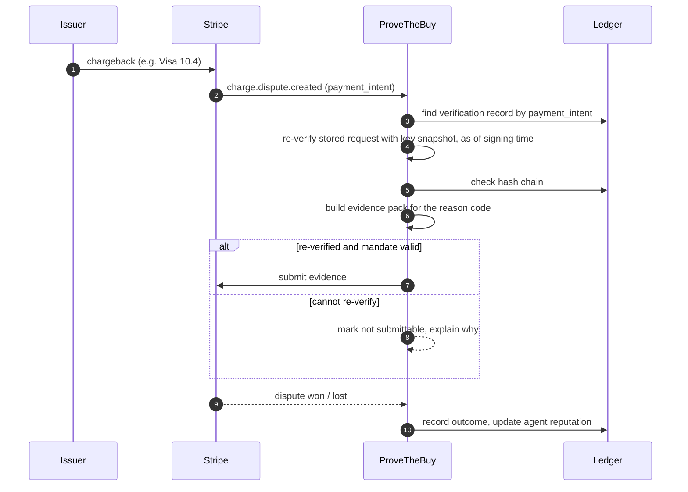
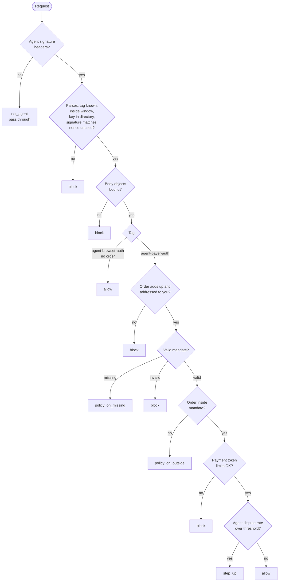

# Flows

## 1. Setup

```mermaid
sequenceDiagram
  autonumber
  participant Dev as Merchant developer
  participant CLI as provethebuy CLI
  participant App as Checkout server
  Dev->>CLI: traffic-check access.log
  CLI-->>Dev: 216 agent requests, 51 on checkout, 14 signed
  Dev->>CLI: init
  CLI-->>Dev: provethebuy.policy.yaml (shadow mode)
  Dev->>App: add capture() + verify() before /checkout
  Dev->>App: deploy
  Note over App: Shadow mode: decisions recorded, nothing blocked
  Dev->>App: after a week, set mode: enforce
```

## 2. Order time

```mermaid
sequenceDiagram
  autonumber
  participant A as Shopper's agent
  participant M as Middleware
  participant V as Verifier
  participant K as Key directory
  participant R as Replay store
  participant L as Ledger
  participant H as Checkout handler
  A->>M: POST /checkout (signed, with mandate + payment token)
  M->>V: raw request + parsed body
  V->>K: resolve keyid
  K-->>V: public key + snapshot hash
  V->>V: verify signature over @authority, @path
  V->>R: nonce seen before?
  R-->>V: no (remembered until expiry)
  V->>V: check mandate chain, order hash, limits, policy
  V-->>M: decision + checks
  alt enforce mode and block
    M-->>A: 403
  else enforce mode and step_up
    M-->>A: 409 (ask the shopper to confirm)
  else allow, or shadow mode
    M->>H: req.provethebuy
    H->>L: record(result, payment_intent)
    H-->>A: 200
  end
```

## 3. Dispute time

```mermaid
sequenceDiagram
  autonumber
  participant I as Issuer
  participant S as Stripe
  participant P as ProveTheBuy
  participant L as Ledger
  I->>S: chargeback (e.g. Visa 10.4)
  S->>P: charge.dispute.created (payment_intent)
  P->>L: find verification record by payment_intent
  P->>P: re-verify stored request with key snapshot, as of signing time
  P->>L: check hash chain
  P->>P: build evidence pack for the reason code
  alt re-verified and mandate valid
    P->>S: submit evidence
  else cannot re-verify
    P-->>P: mark not submittable, explain why
  end
  S-->>P: dispute won / lost
  P->>L: record outcome, update agent reputation
```

## 4. How a decision is reached

```mermaid
flowchart TD
  S([Request]) --> H{Agent signature<br/>headers?}
  H -- no --> NA[not_agent<br/>pass through]
  H -- yes --> SIG{Parses, tag known,<br/>inside window,<br/>key in directory,<br/>signature matches,<br/>nonce unused?}
  SIG -- no --> B1[block]
  SIG -- yes --> BO{Body objects<br/>bound?}
  BO -- no --> B2[block]
  BO -- yes --> T{Tag}
  T -- agent-browser-auth<br/>no order --> AL1[allow]
  T -- agent-payer-auth --> O{Order adds up and<br/>addressed to you?}
  O -- no --> B3[block]
  O -- yes --> MD{Valid mandate?}
  MD -- missing --> PM[policy: on_missing]
  MD -- invalid --> B4[block]
  MD -- valid --> IN{Order inside<br/>mandate?}
  IN -- no --> PO[policy: on_outside]
  IN -- yes --> TL{Payment token<br/>limits OK?}
  TL -- no --> B5[block]
  TL -- yes --> RP{Agent dispute rate<br/>over threshold?}
  RP -- yes --> SU[step_up]
  RP -- no --> AL2[allow]
```

The strictest outcome wins: a later check can raise `allow` to `step_up` or `block`, never lower it.
